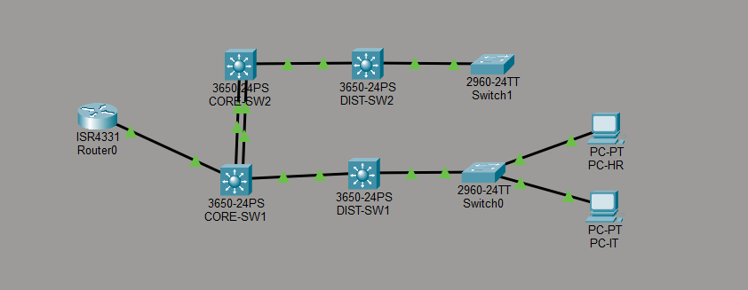

# 🌐 Multi-Tier Enterprise Campus Topology & Data Center Routing


A multi-site, 3-tier enterprise campus network simulation built from the ground up in Cisco Packet Tracer. This project demonstrates high availability, L3 Core Switch Virtual Interface (SVI) routing, LACP link aggregation, multi-area OSPF routing, central DHCP relaying, and perimeter security controls (Extended ACLs & Native VLAN Hardening).

---

## 📐 Architecture & IP Addressing Schema

The network follows Cisco's **Three-Tier Hierarchical Model** (Core, Distribution, and Access layers) spanning an HQ Campus, a Remote Branch, a Data Center Server Farm, and an Internet Edge.

| Zone / Site | Department | VLAN ID | Subnet / Mask | Default Gateway | Key Feature |
| :--- | :--- | :--- | :--- | :--- | :--- |
| **HQ Campus** | HR | `VLAN 10` | `10.10.10.0/24` | `10.10.10.1` | Access Control Restricted |
| **HQ Campus** | Engineering | `VLAN 20` | `10.10.20.0/24` | `10.10.20.1` | High Bandwidth Trunking |
| **HQ Campus** | Finance | `VLAN 30` | `10.10.30.0/24` | `10.10.30.1` | Isolated Broadcast Domain |
| **Branch Office** | Sales | `VLAN 40` | `192.168.40.0/24` | `192.168.40.1` | Dynamic DHCP Relay |
| **Branch Office** | Support | `VLAN 50` | `192.168.50.0/24` | `192.168.50.1` | Local Gateway Redundancy |
| **Data Center** | Internal Servers | `VLAN 100` | `172.16.100.0/24` | `172.16.100.1` | Static IPs (DNS/HTTP/DHCP) |
| **Backbone Transit**| Core Transit | N/A | `172.16.0.0/30` | N/A | OSPF Backbone (Area 0) |

---

## 🖼️ Network Topology View



---

## 🛠️ Key Technical Implementations

### 1. High Availability & Link Aggregation (LACP)
* Configured IEEE 802.3ad **LACP EtherChannels** (Port-Groups) between Core and Distribution switches to double bandwidth and prevent single points of link failure.
* Tuned Spanning Tree Protocol (STP) to eliminate Layer 2 switching loops while maintaining active redundancy.

### 2. High-Speed L3 Inter-VLAN Routing & DHCP Relay
* Implemented **Switch Virtual Interfaces (SVIs)** on Cisco 3650 L3 Core Switches to offload inter-VLAN routing from software routers to L3 hardware switching.
* Deployed dynamic addressing across subnets using a central DHCP Server in `VLAN 100` coupled with `ip helper-address` configs on core switch interfaces.

### 3. Multi-Area OSPF Dynamic Routing
* Established **Multi-Area OSPF (Area 0 Backbone & Area 1 Branch)** to ensure dynamic, shortest-path determination and sub-second convergence across the enterprise topology.

### 4. Enterprise Security Controls & Traffic Filtering
* **Extended Access Control Lists (ACLs):** Enforced policy-based traffic isolation via named Extended ACL (`BLOCK_IT_TO_HR`) on `CORE-SW1` to restrict unauthorized cross-subnet access between IT/Admin and HR departments while permitting essential outbound traffic flow.
* **Native VLAN Hardening:** Explicitly configured dedicated native VLAN assignments (`VLAN 99`) across trunk links to mitigate Layer 2 VLAN hopping attacks.

---

## 🧪 Verification & Proof of Execution

### 1. Security ACL Rule Verification
Verified active Extended Access List rules applied on `CORE-SW1`:

```text
CORE-SW1# show ip access-lists
Extended IP access list BLOCK_IT_TO_HR
    10 deny ip 10.0.0.0 0.0.255.255 10.0.0.0 0.0.255.255
    20 permit ip any any
