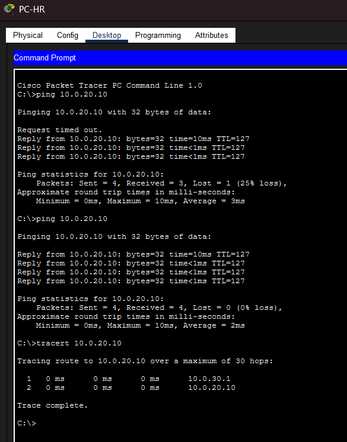

# 🌐 Enterprise Campus Network Simulation

A multi-tier enterprise campus network simulation built in Cisco Packet Tracer. This project demonstrates Layer 2 trunking, VLAN segmentation, Native VLAN security, and Layer 3 Inter-VLAN routing across Core and Access layers.

---

## 📐 Architecture & IP Addressing Schema

The network follows Cisco's Hierarchical Model (Core, Distribution, and Access layers) with inter-VLAN routing handled directly on the L3 Core Switch.

| Device / Host | Interface | VLAN ID | Subnet Mask | IP Address / Gateway | Status |
| :--- | :--- | :--- | :--- | :--- | :--- |
| **PC-HR** | Fa0/2 | `30 (HR_SALES)` | `255.255.255.0` | `10.0.30.10` / `10.0.30.1` | Active |
| **PC-IT** | Fa0/1 | `20 (IT_ENGINEERING)` | `255.255.255.0` | `10.0.20.10` / `10.0.20.1` | Active |
| **CORE-SW1** | SVI Vlan10 | `10 (MANAGEMENT)` | `255.255.255.0` | `10.0.10.1` | Active |
| **CORE-SW1** | SVI Vlan20 | `20 (IT_ENGINEERING)` | `255.255.255.0` | `10.0.20.1` | Active |
| **CORE-SW1** | SVI Vlan30 | `30 (HR_SALES)` | `255.255.255.0` | `10.0.30.1` | Active |
| **CORE-SW1** | SVI Vlan99 | `99 (NATIVE_VLAN)` | `255.255.255.0` | `10.0.99.1` | Active |

---

## 🖼️ Network Topology View


---

## 🛠️ Key Technical Implementations

### 1. High-Speed L3 Inter-VLAN Routing
* Implemented **Switch Virtual Interfaces (SVIs)** on the Cisco 3650 L3 Core Switch (`CORE-SW1`) to offload inter-VLAN routing to hardware switching.
* Handled cross-subnet communication seamlessly between HR (`VLAN 30`) and IT (`VLAN 20`).

### 2. Trunking & Native VLAN Security
* Configured **802.1Q trunk links** between Access, Distribution, and Core switches.
* Hardened Layer 2 security by moving trunk native traffic away from default `VLAN 1` to a dedicated Native VLAN (`VLAN 99`).

---

## 🧪 Verification & Proof of Execution

Full Layer 3 reachability was verified between **PC-HR (`10.0.30.10`)** and **PC-IT (`10.0.20.10`)**.



### Execution Results:
1. **ICMP Ping:** Initial ping experienced expected ARP resolution timeout (`25% loss`), followed immediately by 100% successful ICMP replies (`0% loss`).
2. **Traceroute:** Confirmed a clean 2-hop route:
   * **Hop 1:** `10.0.30.1` (Core Switch SVI Vlan30 Default Gateway)
   * **Hop 2:** `10.0.20.10` (Target PC-IT Host)

---

## 📁 Repository Structure

```text
enterprise-campus-network-simulation/
├── assets/
│   ├── network-topology.png
│   └── ping-tracert-validation.png
├── configs/
│   ├── CORE-SW1.txt
│   └── DIST-SW-HQ.txt
├── enterprise-campus-topology.pkt
└── README.md
